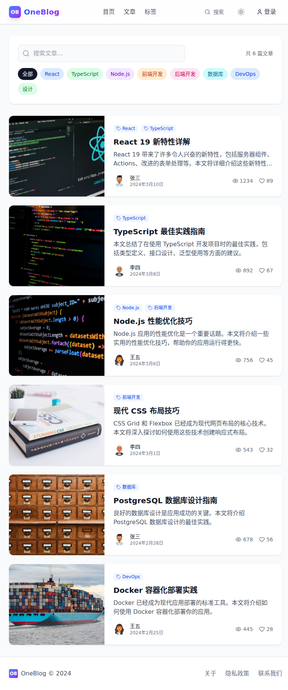
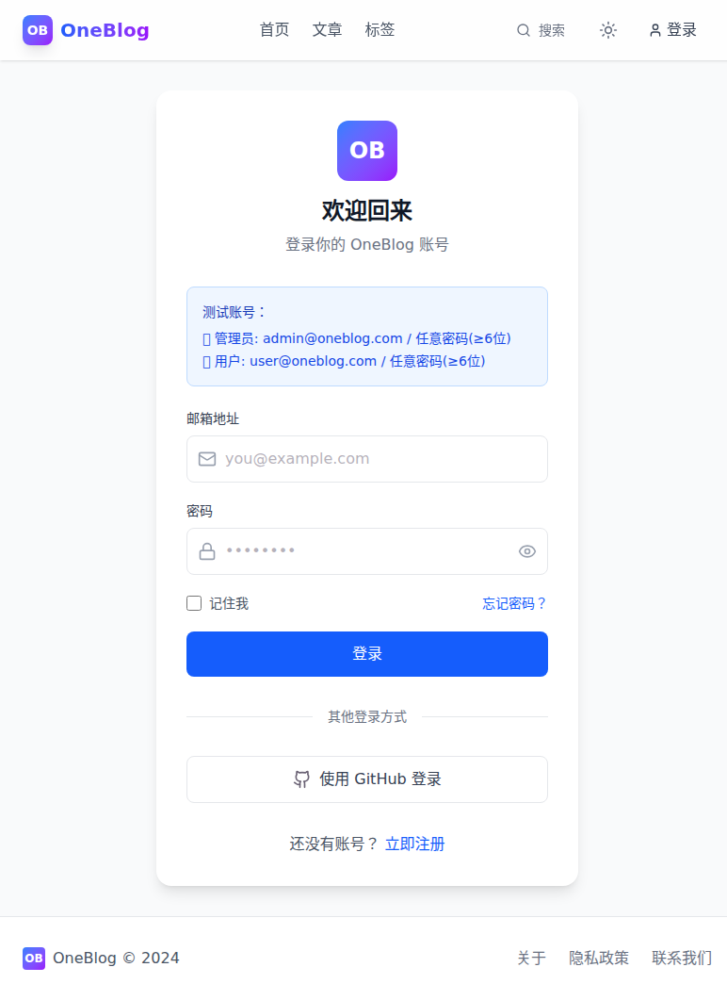
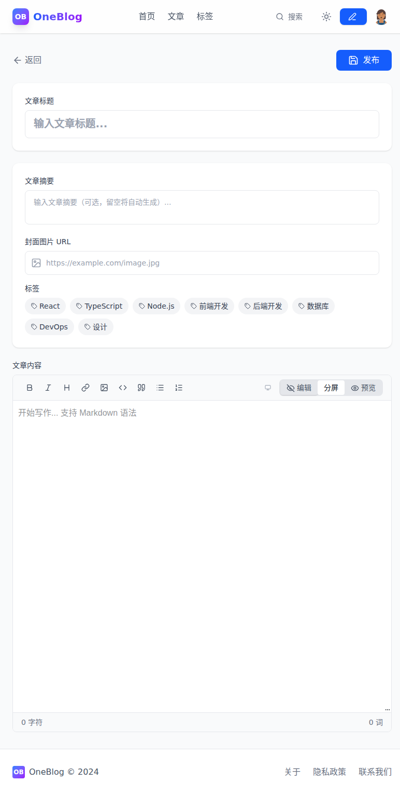
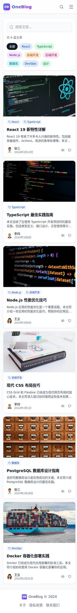

# one-blog

## 预览



---

## 项目概述

**one-blog** 是一个现代化的博客系统，采用 .NET 8 后端 + React 前端技术栈构建。

### 核心特性

- 📝 **文章管理**: Markdown 编辑器，支持代码高亮
- 🏷️ **分类标签**: 灵活的文章组织方式
- 💬 **评论系统**: 嵌套回复，支持审核
- 🔍 **全文搜索**: 快速定位文章内容
- 🌙 **暗色模式**: 自动/手动切换
- 📱 **响应式设计**: 完美适配移动端

---

## 技术栈

### 后端
- **框架**: ASP.NET Core 8
- **数据库**: PostgreSQL + EF Core
- **缓存**: Redis
- **搜索**: Elasticsearch (可选)
- **认证**: JWT Bearer

### 前端
- **框架**: React 18 + TypeScript
- **构建**: Vite
- **样式**: Tailwind CSS
- **状态**: Zustand / Redux Toolkit
- **UI 组件**: Headless UI / Radix UI

---

## 快速开始

### 环境要求
- .NET 8 SDK
- Node.js 18+
- PostgreSQL 15+
- Redis 7+

### 本地开发

```bash
# 1. 克隆项目
git clone <repository-url>
cd one-blog

# 2. 启动后端
cd src/Backend
dotnet restore
dotnet run

# 3. 启动前端 (新终端)
cd src/Frontend
npm install
npm run dev
```

访问 http://localhost:5173 查看前端，API 运行在 http://localhost:5000

---

## 项目结构

```
one-blog/
├── src/
│   ├── Backend/          # ASP.NET Core API
│   │   ├── Controllers/
│   │   ├── Models/
│   │   ├── Services/
│   │   └── Program.cs
│   ├── Frontend/         # React SPA
│   │   ├── src/
│   │   ├── public/
│   │   └── package.json
│   └── Shared/           # 共享模型/常量
├── docs/                 # 文档
├── scripts/              # 自动化脚本
├── docker-compose.yml    # 本地开发环境
└── README.md
```

---

## 截图展示

| 页面 | 截图 | 说明 |
|------|------|------|
| 首页 |  | 文章列表、标签筛选 |
| 登录页 |  | 用户登录界面 |
| 编辑器 |  | Markdown 文章编辑器（需登录） |
| 移动端 |  | 响应式移动端适配 |

---

## 开发团队

| 角色 | 负责人 | 职责 |
|------|--------|------|
| PM | - | 项目管理、进度跟踪 |
| Backend | - | API 开发、数据库设计 |
| Frontend | - | UI 开发、交互实现 |
| DevOps | - | 部署、CI/CD |

---

## 路线图

详见 [roadmap.md](./roadmap.md)

---

## 许可证

MIT License
