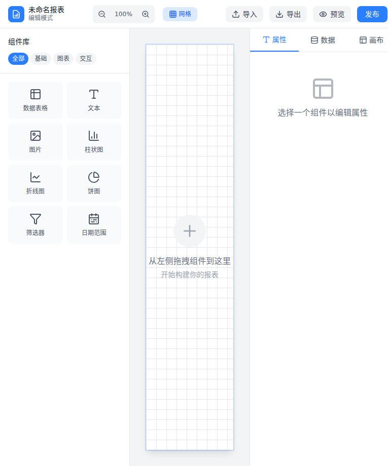

# One-Report

> 轻量级低代码报表工具，让数据可视化变得简单高效

<!-- SCREENSHOT:homepage -->
![One-Report 首页预览][SCREENSHOT:homepage]

## 📸 产品预览

| 功能模块 | 截图 |
|---------|------|
| 报表设计器 |  |
| 数据源管理 | [待截图] |
| 报表预览 | [待截图] |
| 导出管理 | [待截图] |

---

## 🎯 项目概述

One-Report 是一款面向中小型企业的**低代码报表工具**，专注于解决传统报表开发周期长、维护成本高的问题。

### 核心特性

| 特性 | 描述 |
|-----|------|
| 🎨 **拖拽式报表设计器** | 可视化拖拽组件，无需编码即可设计专业报表 |
| 🔌 **多数据源支持** | 支持 MySQL、PostgreSQL、SQL Server、Oracle、REST API 等多种数据源 |
| ⚡ **高性能导出** | 流式处理技术，支持百万级数据导出，内存占用 < 512MB |
| 🖥️ **轻量部署** | 单二进制可执行文件，可在 1C1G 低配服务器流畅运行 |
| 📱 **响应式设计** | 报表自适应 PC、平板、移动端 |

---

## 🏗️ 技术架构

```
┌─────────────────────────────────────────────────────────┐
│                      前端层 (Frontend)                    │
│  ┌─────────────┐  ┌─────────────┐  ┌─────────────────┐  │
│  │ 报表设计器   │  │ 数据源配置   │  │ 报表渲染引擎     │  │
│  └─────────────┘  └─────────────┘  └─────────────────┘  │
└─────────────────────────────────────────────────────────┘
                           │
┌─────────────────────────────────────────────────────────┐
│                      API 网关层                          │
│              RESTful API / WebSocket                     │
└─────────────────────────────────────────────────────────┘
                           │
┌─────────────────────────────────────────────────────────┐
│                      服务层 (Backend)                     │
│  ┌─────────────┐  ┌─────────────┐  ┌─────────────────┐  │
│  │ 报表引擎     │  │ 导出服务     │  │ 数据源管理       │  │
│  │  - 布局计算  │  │  - PDF流式   │  │  - 连接池        │  │
│  │  - 数据绑定  │  │  - Excel流式 │  │  - 查询引擎      │  │
│  └─────────────┘  └─────────────┘  └─────────────────┘  │
└─────────────────────────────────────────────────────────┘
                           │
┌─────────────────────────────────────────────────────────┐
│                      数据层                              │
│  ┌─────────────┐  ┌─────────────┐  ┌─────────────────┐  │
│  │ 元数据库     │  │ 外部数据源   │  │ 文件存储         │  │
│  │ (SQLite)    │  │ (MySQL等)   │  │ (MinIO/本地)    │  │
│  └─────────────┘  └─────────────┘  └─────────────────┘  │
└─────────────────────────────────────────────────────────┘
```

### 技术栈

- **后端**: .NET 9 / ASP.NET Core
- **前端**: React 18 + TypeScript + Ant Design
- **报表渲染**: 自研 Canvas/SVG 混合渲染引擎
- **PDF导出**: PdfSharp + 流式生成
- **Excel导出**: EPPlus + 流式写入
- **数据库**: SQLite (元数据) + 各类数据源连接器

---

## 🚀 快速开始

### 环境要求

- **最低配置**: 1核 CPU / 1GB RAM / 10GB 存储
- **推荐配置**: 2核 CPU / 2GB RAM / 50GB 存储
- **操作系统**: Linux / Windows / macOS
- **运行时**: .NET 9 Runtime

### 安装部署

```bash
# 下载最新版本
wget https://github.com/your-org/one-report/releases/latest/download/one-report-linux-x64.tar.gz

# 解压
tar -xzf one-report-linux-x64.tar.gz
cd one-report

# 启动服务
./one-report --urls "http://0.0.0.0:8080"
```

### Docker 部署

```bash
docker run -d \
  --name one-report \
  -p 8080:8080 \
  -v /data/one-report:/app/data \
  your-org/one-report:latest
```

访问 http://localhost:8080 开始使用。

---

## 📖 使用指南

### 1. 创建数据源

<!-- SCREENSHOT:datasource-create -->
![创建数据源][SCREENSHOT:datasource-create]

1. 进入「数据源管理」
2. 点击「新建数据源」
3. 选择数据库类型，填写连接信息
4. 测试连接并保存

### 2. 设计报表

<!-- SCREENSHOT:designer-workspace -->
![报表设计器][SCREENSHOT:designer-workspace]

1. 进入「报表设计器」
2. 拖拽组件（表格/图表/文本/图片）到画布
3. 绑定数据字段
4. 配置样式和布局
5. 保存报表模板

### 3. 预览与导出

<!-- SCREENSHOT:preview-export -->
![预览导出][SCREENSHOT:preview-export]

1. 点击「预览」查看渲染效果
2. 选择导出格式（PDF/Excel/HTML）
3. 设置导出参数（分页/纸张/水印）
4. 下载导出的文件

---

## 📋 功能清单

### 已实现

- [x] 多数据源连接管理
- [x] 基础报表组件（表格、文本、图片）
- [x] 拖拽式报表设计器
- [x] 报表预览功能
- [x] PDF 导出（流式）
- [x] Excel 导出（流式）

### 开发中

- [ ] 图表组件（柱状图、折线图、饼图）
- [ ] 数据筛选器
- [ ] 报表参数支持
- [ ] 定时任务/邮件推送

### 规划中

- [ ] 移动端设计器
- [ ] 数据大屏支持
- [ ] 多租户架构
- [ ] 报表权限管理

---

## 📈 性能指标

| 场景 | 数据量 | 内存占用 | 导出耗时 |
|-----|--------|---------|---------|
| 简单表格 | 1万行 | ~120MB | < 2s |
| 复杂报表 | 10万行 | ~180MB | < 8s |
| 大数据导出 | 100万行 | ~350MB | < 45s |

*测试环境: 2C4G 云服务器, SSD 存储*

---

## 🤝 参与贡献

欢迎提交 Issue 和 PR！

1. Fork 本仓库
2. 创建特性分支 (`git checkout -b feature/AmazingFeature`)
3. 提交更改 (`git commit -m 'Add some AmazingFeature'`)
4. 推送到分支 (`git push origin feature/AmazingFeature`)
5. 打开 Pull Request

---

## 📄 许可证

[MIT](LICENSE) © 2026 One-Report Team

---

## 🔗 相关链接

- [项目路线图](./roadmap.md)
- [里程碑计划](./milestones.md)
- [开发文档](./docs/development.md)
- [API 文档](./docs/api.md)

---

<!-- 截图占位符定义 -->
[SCREENSHOT:homepage]: ./docs/screenshots/homepage.png "待补充 - 首页完整截图"
[SCREENSHOT:designer]: ./docs/screenshots/designer.png "待补充 - 报表设计器截图"
[SCREENSHOT:datasource]: ./docs/screenshots/datasource.png "待补充 - 数据源管理截图"
[SCREENSHOT:preview]: ./docs/screenshots/preview.png "待补充 - 报表预览截图"
[SCREENSHOT:export]: ./docs/screenshots/export.png "待补充 - 导出管理截图"
[SCREENSHOT:datasource-create]: ./docs/screenshots/datasource-create.png "待补充 - 创建数据源截图"
[SCREENSHOT:designer-workspace]: ./docs/screenshots/designer-workspace.png "待补充 - 设计器工作区截图"
[SCREENSHOT:preview-export]: ./docs/screenshots/preview-export.png "待补充 - 预览导出截图"
